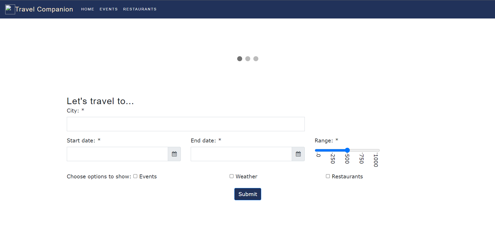

# Travel-Companion

## Description:

An application to make your travels easier to your next destiantion. Just tell us where and when you want to go , and access all the needed inforamtion all in one place. Find out what the weather is going to be, learn about new places to visit and have a meal, or plan an exciting experience with local events.

## Motivation for development

With so many options of activities and restaurants we wanted to create something to help users plan their trips and provide real time information of events, food and weather in a chosen destination.

## User story:

As a traveller:

* I WANT to see personalized information about events, weather and points of interest in my chosen city

* SO THAT I can discover local events, check weather update, and find the best restaurants and activities in my location

## Can be accessed at:

https://whydidichoosephysics.github.io/Password-Generator/

## Usage

* Before launching site please make sure to go to:

https://cors-anywhere.herokuapp.com/corsdemo

and request temporary access to the demo server. This will allow our APIs to function properly in the frontend.

* Input the name of your destination, the dates you are interested in, how far you're willing to travel, and tick the options that you wish to see

* Then let the page do its magic and show you all the available information
## Credits

* V: https://github.com/VanessaDantonio
* W: https://github.com/wagnerona
